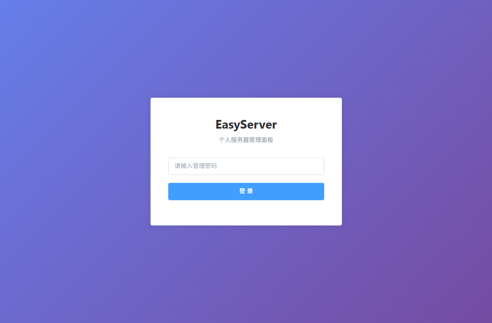
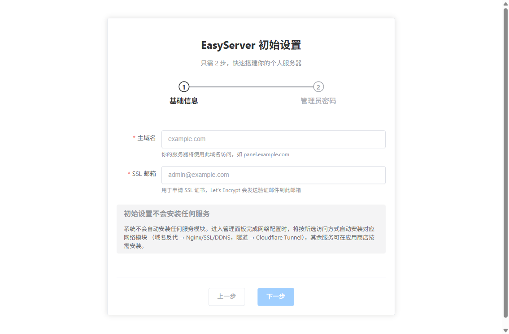
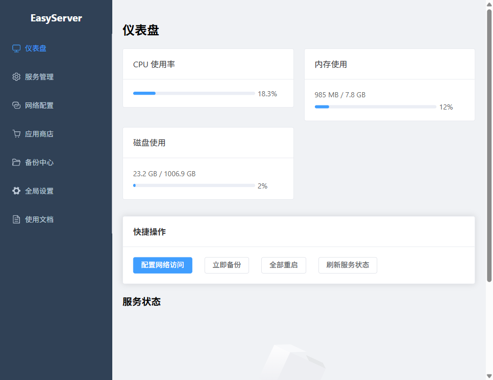
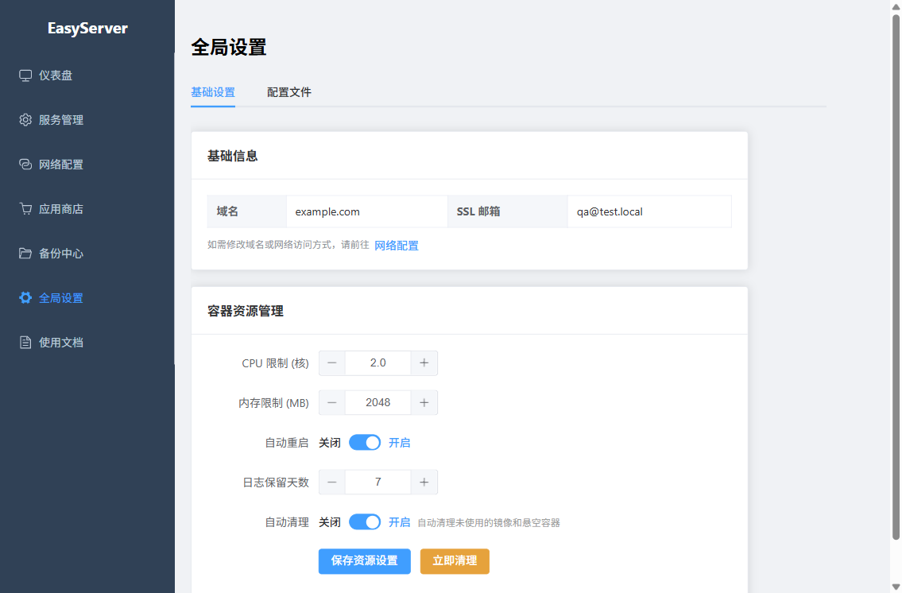
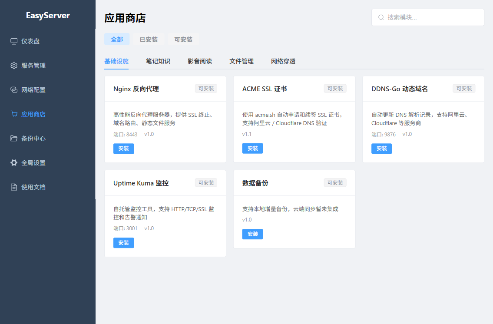
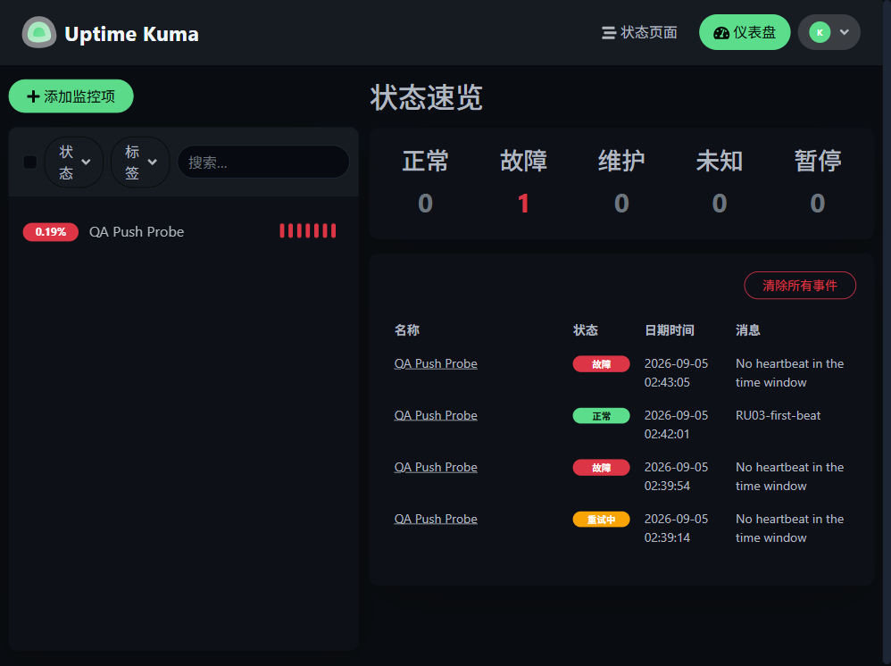
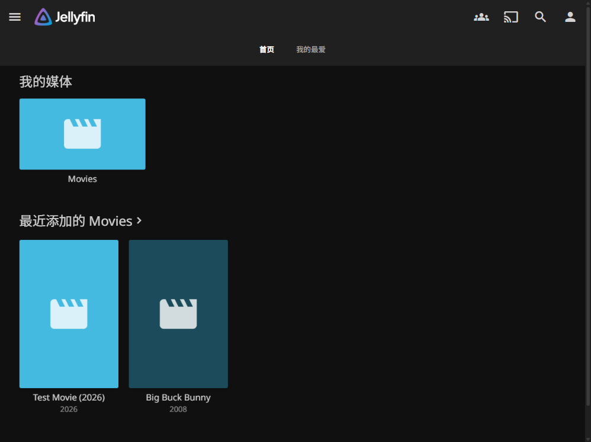

# 从零开始：在 WSL 里跑起你的第一个自托管服务

> 你将达成：装好 Docker、启动 EasyServer 管理面板、并从面板装上第一个真正能用的笔记服务 ｜ 预计总耗时约 1 小时（其中首次镜像构建约 31 分钟，挂机等即可） ｜ 适用版本 v0.3.0+（含截至 commit 4071298 的 9 项体验修复）

本指南的每一个命令、输出与耗时都来自 WSL2 + Ubuntu 24.04 的完整实测（Docker 29.7.2、Compose v5.5.0、核心镜像约 538 MB、模块商店 13 个模块）。你不需要懂 Docker，照着做即可；WSL 与原生 Linux 的差异会在原地标注。

---

## 开始前：你需要准备什么

| 项目 | 要求 |
|------|------|
| 系统 | Windows 上的 WSL2（推荐 Ubuntu 24.04）或任意原生 Linux |
| 权限 | 当前用户属于 `sudo` 组 |
| 网络 | 可访问 `archive.ubuntu.com`、`download.docker.com`、Docker Hub（或其镜像加速站） |
| 磁盘 | 预留 3 GB 以上（核心镜像 538 MB + 模块镜像 + 数据） |

WSL2 与原生 Linux 最重要的三个差异（后文会反复出现）：

1. **无 systemd**：WSL2 默认没有 systemd，启动 Docker 要用 `sudo service docker start`，且**每次重启 WSL 后都要再执行一次**。
2. **端口视图共享（mirrored 模式）**：Windows 侧占用的端口，WSL 里也绑不了，而且 WSL 内的 `ss`/`lsof` **查不到**（要用 `netstat.exe`，见第 3 步排错）。
3. **docker 组权限**：把自己加入 docker 组后，**当前已打开的终端不会立即生效**，用 `sg docker -c "…"` 过渡。

---

## 第 1 步：确认 Docker 已就绪

- **操作**：打开终端，依次执行：

```bash
docker version          # 或 sg docker -c "docker version"（见下方排错）
docker compose version
docker run --rm hello-world
```

- **你会看到**：`docker version` 输出 Client 与 Server 两段版本号（实测 Server 版本 `29.7.2`）；`docker compose version` 显示 `v5.5.0`；hello-world 最后打印 **`Hello from Docker!`**。三条都正常，直接跳到第 3 步。
- **截图**：无（终端输出，无界面）。
- **排错**：

| 现象/报错 | 原因 | 解法 |
|---|---|---|
| `permission denied … /var/run/docker.sock` | 当前用户不在 docker 组，或组身份未刷新 | 临时用 `sg docker -c "docker version"` 执行；或 `sudo usermod -aG docker $USER` 后**重开终端** |
| `Cannot connect to the Docker daemon` | Docker 服务没启动（WSL 重启后常见） | `sudo service docker start`（见第 2 步坑三） |
| 没装 Docker / 版本低于 24 | — | 做第 2 步 |

---

## 第 2 步：安装 Docker（三个坑都有实测解法）

### 2a. 添加官方 apt 源

- **操作**：

```bash
sudo apt-get remove -y docker.io docker-doc docker-compose podman-docker containerd runc
sudo apt-get update
sudo apt-get install -y ca-certificates curl gnupg
sudo install -m 0755 -d /etc/apt/keyrings
curl -fsSL https://download.docker.com/linux/ubuntu/gpg | sudo gpg --dearmor -o /etc/apt/keyrings/docker.gpg
echo "deb [arch=$(dpkg --print-architecture) signed-by=/etc/apt/keyrings/docker.gpg] https://download.docker.com/linux/ubuntu $(. /etc/os-release && echo $VERSION_CODENAME) stable" | sudo tee /etc/apt/sources.list.d/docker.list > /dev/null
```

- **你会看到**：移除命令对未安装的包提示跳过或 `Unable to locate package`，属正常；`gpg` 步骤无报错即成功（key 指纹应为 `9DC8 5822 9FC7 DD38 854A E2D8 8D81 803C 0EBF CD88`）。
- **截图**：无（终端输出）。
- **排错**：

| 现象/报错 | 原因 | 解法 |
|---|---|---|
| `apt-get update` 卡住、IPv6 地址超时 | 网络对 IPv6 路由不佳（**实测坑一**） | 本步骤所有命令前加 `-o Acquire::ForceIPv4=true`（如 `sudo apt-get -o Acquire::ForceIPv4=true update`）；永久生效：`echo 'Acquire::ForceIPv4 "true";' \| sudo tee /etc/apt/apt.conf.d/99force-ipv4` |

### 2b. 安装 Docker Engine

- **操作**：

```bash
sudo apt-get -o Acquire::ForceIPv4=true install -y \
  docker-ce docker-ce-cli containerd.io docker-buildx-plugin docker-compose-plugin
```

- **你会看到**：实测安装版本 docker-ce `29.7.2`、containerd `v2.3.4`、runc `1.4.3`、Compose 插件 `v5.5.0`。
- **截图**：无。
- **排错**：安装中断（`Connection reset by peer` 之类）直接**重跑同一条命令**，已下载的包会复用。

### 2c. 配置镜像加速（不配几乎必超时）

- **操作**：实测直连 Docker Hub 会被 DNS 污染（`registry-1.docker.io` 解析到错误地址后超时）。写入三个实测可用的加速站：

```bash
sudo tee /etc/docker/daemon.json <<'EOF'
{
  "registry-mirrors": [
    "https://docker.1ms.run",
    "https://docker.m.daocloud.io",
    "https://dockerproxy.net"
  ]
}
EOF
sudo service docker restart
docker info | grep -A4 "Registry Mirrors"
```

- **你会看到**：`docker info` 列出你配置的三个 mirror 地址。
- **截图**：无。
- **排错**：

| 现象/报错 | 原因 | 解法 |
|---|---|---|
| 后续拉镜像长时间无进度、最终超时 | 加速站限速或失效（**实测限速 25–40 KB/s 属常见**） | 换当前可用的加速站；大镜像（如 jellyfin）拉取要耐心，EasyServer 引擎对拉取失败也有自动降级与重试 |
| `docker info` 报 daemon 未运行 | 改了 daemon.json 但服务未重启 | `sudo service docker restart` |

### 2d. 启动服务（无 systemd 的正确姿势）

- **操作**：

```bash
sudo service docker start
sudo service docker status    # 应显示 Docker is running
```

- **你会看到**：`status` 输出 **`Docker is running`**。
- **截图**：无。
- **排错**：

| 现象/报错 | 原因 | 解法 |
|---|---|---|
| `System has not been booted with systemd as init system (PID 1). Can't operate.`（**实测坑三**） | WSL2 默认无 systemd，不能用 `systemctl` | 用 `sudo service docker start`；想用 systemd 可在 `/etc/wsl.conf` 写 `[boot]` `systemd=true` 后在 Windows 侧 `wsl.exe --shutdown` 重进 |
| **重启 WSL 后容器全没了**（其实还在） | Docker 服务不自启 | 每次进 WSL 先 `sudo service docker start`，再 `docker compose up -d` 拉起 EasyServer（容器与数据都保留） |

---

## 第 3 步：获取代码，构建并启动面板

### 3a. 克隆代码

- **操作**：

```bash
git clone https://github.com/liangfei-sun/EasyServer.git ~/easyserver
cd ~/easyserver
```

- **你会看到**：仓库约几十 MB，克隆完成。
- **截图**：无。
- **排错**：README 里的地址是 SSH 形式（`git@github.com:...`），没配 SSH key 就用上面的 HTTPS 地址，功能一致。

### 3b. 创建 .env（必做，否则启动直接失败）

- **操作**：

```bash
cp .env.example .env
chmod 600 .env
```

然后编辑 `.env`，把两项数据目录改成你自己的家目录（默认值是容器内路径，直接用会把数据建在系统根目录 `/data`、`/easyserver_data`）：

```bash
PROJECT_ROOT=/home/<你的用户名>/easyserver_data
DATA_DIR=/home/<你的用户名>/easyserver_data/data
```

再追加一条固定密钥（不设的话容器每次重启所有登录都会失效）：

```bash
echo "JWT_SECRET=$(openssl rand -hex 32)" >> .env
```

- **你会看到**：`cat .env` 里 `PROJECT_ROOT`/`DATA_DIR` 指向你的家目录，末尾多了一行 `JWT_SECRET=…`。
- **截图**：无。
- **排错**：

| 现象/报错 | 原因 | 解法 |
|---|---|---|
| `docker compose up` 报 `env file not found` | 没建 `.env` | 回到本步第一条命令 |

### 3c. 构建镜像

- **操作**：

```bash
docker compose build
```

- **你会看到**：多阶段构建（Python 3.11 后端 + Node 20 前端）。**首次实测约 31 分钟**（其中拉取 node 基础层约 29.6 分钟，慢网络下属正常）；产物镜像 `easyserver/core` 约 538 MB。进度条长时间不动是在等基础层。
- **截图**：无（终端输出）。
- **排错**：构建中途失败（曾实测 apt 访问被重置导致 `exit 100`）——**直接重跑 `docker compose build`**，已完成层走缓存，重试成本很低。

### 3d. 启动

- **操作**：

```bash
docker compose up -d
docker compose ps
```

- **你会看到**：首次启动时容器内自动完成初始化（生成运行时配置、创建 `easyserver-proxy` 网络、铺开 13 个模块模板）；`docker compose ps` 显示 `easyserver-core` 状态 **`Up (healthy)`**（健康检查通过约需 **30–60 秒**：引擎健康检查为 30 秒间隔 + 30 秒启动宽限期，首次初始化时接近上限，属正常）。
- **截图**：无。
- **排错**：

| 现象/报错 | 原因 | 解法 |
|---|---|---|
| 启动报 `address already in use`（8900 端口） | 默认面板端口 8900 被占。**WSL2 mirrored 模式下 Windows 侧占用在 WSL 里查不到**（实测 8900 被 Windows 进程 PID 12664 占用） | 用 `netstat.exe` 在 Windows 侧确认：`/mnt/c/Windows/System32/netstat.exe -ano \| findstr 8900`。换端口：新建 `docker-compose.override.yml`，内容见下，再 `docker compose up -d`（本指南后续一律用 8901） |
| 其他端口冲突 | 同上 | 同上，把 override 里的端口号换掉 |

`docker-compose.override.yml`（与 `docker-compose.yml` 同目录；作用是把面板映射到 8901 并持久化引擎配置卷）：

```yaml
services:
  easyserver-core:
    ports: !override
      - "127.0.0.1:8901:8000"
    volumes:
      - easyserver-app-data:/app/data
volumes:
  easyserver-app-data:
```

> 用 `!override` 是为了整体替换默认的 `ports` 列表（避免 8900 仍在映射列表里导致启动失败）。`easyserver-app-data` 命名卷用于持久化面板配置（管理密码、已装模块清单等），**必须在第一次启动前就加好**。

---

## 第 4 步：打开面板，完成初始化向导

- **操作**：浏览器打开 `http://localhost:8901`（没做端口替换则是 `http://localhost:8900`）。首次访问进入三步向导：
  1. 填写主域名（没有域名可先填 `example.com` 占位，之后在网络配置中改）
  2. 填写 SSL 邮箱（用于 Let's Encrypt 证书通知）
  3. 设置管理密码
- **你会看到**：向导完成后进入登录页。**系统没有用户名、没有默认密码**——向导第 3 步设置的密码就是唯一登录凭据，请牢记。登录成功后面板首页显示模块概览，左侧导航包含应用商店、网络配置、设置等入口（设置页实拍见下图，引擎级配置项都在这里）。等价的命令行操作（实测）：

```bash
curl -s -X POST http://localhost:8901/api/config/setup \
  -H 'Content-Type: application/json' \
  -d '{"domain":"example.com","ssl_email":"admin@example.com","admin_password":"<你的管理密码>"}'
curl -s -X POST http://localhost:8901/api/config/auth/login \
  -H 'Content-Type: application/json' \
  -d '{"password":"<你的管理密码>"}'
# 返回：{"token":"eyJ...","success":true}
```

- **截图**：   
- **排错**：

| 现象/报错 | 原因 | 解法 |
|---|---|---|
| 页面打不开 | 容器没起来或端口映射不对 | `curl -s http://localhost:8901/api/health` 应返回 `{"status":"ok","service":"easyserver-core"}`；不对就 `docker compose ps` 看容器状态与端口列 |
| 登录后过几天要重登 | JWT Token 实测有效期约 7 天 | 重新登录即可；已按 3b 设置 `JWT_SECRET` 的，重启容器不再导致全员掉线 |
| `POST /api/config/setup` 返回已初始化 | setup 只能执行一次 | 直接登录；密码遗失需删除配置卷重新初始化（会丢全部面板配置，慎用） |

---

## 第 5 步：安装你的第一个模块

以笔记应用 **NoteDiscovery** 为例（轻量、秒级安装，也有[独立教程](modules/notediscovery.md)）。

- **操作**：面板左侧进入「应用商店」→ 找到 NoteDiscovery → 点安装 → 填写配置：
  - `NOTEDISCOVERY_PORT`（服务端口）：默认 8000，**若被占用换一个**（实测环境 Windows 占了 8000，改填 `18000`）
  - `NOTEDISCOVERY_AUTH_ENABLED`：启用登录认证（默认开）
  - `NOTEDISCOVERY_PASSWORD`（登录密码）：填你自己的密码（例如 `NotediscoveryQA-2026!`）——**这里填什么，登录应用就用什么**
- **你会看到**：安装任务进入**四阶段进度**（修复后行为，每阶段的真实日志都会展示）：
  1. `prepare`：准备阶段。若模块需要配置文件，会看到 `预创建配置文件 /data/notediscovery/config.yaml（模板渲染 config.yaml.j2）`，数据目录则是 `预创建数据目录并修正属主 1000:1000: /data/notediscovery/data`
  2. `pull`：拉取镜像。镜像已在本地时秒过（日志 `[local-hit] 镜像本地已存在，跳过拉取`）；需要现场构建的模块显示 `[local-build]`；精确版本号被镜像源拒绝时自动降级（`[latest-fallback] 精确 tag 拉取被拒，已降级 latest 并回打原 tag: …`）
  3. `up`：启动容器
  4. `health`：健康门控，确认容器真的稳定运行（而非"进程起了就报成功"）

  实测时间线：`pull(t+0) → up(t+11) → health(t+14) → success(t+23)`，约 **23 秒**完成（镜像本地命中时）。

  > 注：本指南日志与命令示例以默认 `DATA_DIR=/data` 演示；若你在第 3b 步把 `DATA_DIR` 改成了自定义路径（如 `/home/<你的用户名>/easyserver_data/data`），请把示例中的 `/data` 替换为你的路径。
- **截图**：（安装进度页暂无截图，形态为四阶段日志逐行滚动）
- **排错**：

| 现象/报错 | 原因 | 解法 |
|---|---|---|
| 安装失败，stage=`health`，error 含大段容器日志 | 应用启动后崩溃（健康门控拦下了）。**这是功能不是故障**：修复前这类失败会被误报成"安装成功" | 读 error.detail 里的真实原因。例如 `nginx: [emerg] cannot load certificate …` 就是证书路径问题——按原因处理后重装 |
| 安装失败，报端口绑定 `address already in use` | 模块端口被占（Windows 侧占用 WSL 内查不到） | 换端口重装（如 8000 → 18000）；排查命令见第 3d 步 |
| 安装失败，提示必填项缺失（HTTP 400） | 引擎校验配置完整性，不会产生半安装态 | 按 module.yaml 提示补齐必填项（如 filebrowser 需 `FILEBROWSER_DATA_PATH`）重新提交 |
| 一直卡在 pull | 大镜像 + 慢加速站 | 耐心等（pull 阶段超时预算 10 分钟/次，含自动重试与降级）；或先 `docker pull <镜像名>` 预热再装 |

---

## 第 6 步：确认它是"真的健康"，然后登录用起来

- **操作**：安装成功后做两件事——

```bash
# 1) 看容器状态（有 healthcheck 的模块应显示 Up (healthy)）
sg docker -c "docker ps --filter name=easyserver"
# 2) 探一下应用端口（用你安装时填的端口）
curl -s -o /dev/null -w '%{http_code}\n' http://127.0.0.1:18000
```

- **你会看到**：`docker ps` 列出 `easyserver-core` 与 `easyserver-notediscovery`；curl 返回 `303`（未登录跳转登录页，即应用活着）。
- **截图**：无。
- **排错**：无（这一步是给你安全感的）。**为什么要有这一步**：早先版本"安装成功"不代表应用可用（容器崩溃循环也会报成功，实测 nginx 无证书时如此）。修复后引擎的健康门控会替你把关（失败会报真实原因），但**首次使用仍建议亲眼确认一次容器状态**——30 秒换一个放心。

然后登录应用：浏览器打开 `http://127.0.0.1:18000`，用**你在面板安装时填的密码**登录（修复前这里有个大坑：面板填的密码不生效，实际生效的是内部占位值 `change_me_notes`，已修复）。登录后你会看到 NoteDiscovery 的登录页与主页。

> 顺带提醒其他模块的“第一次”：uptime-kuma 是 v2 两段式向导（先选数据库，再建管理员）；calibre-web 默认账号 `admin/admin123`、配库成功后页面不跳转（看绿色提示条）；jellyfin 媒体库会忽略文件名含 `sample` 的视频。

装好后的服务长这样（两张实测截图）：uptime-kuma 的仪表盘（监控项 + 心跳条，加一个监控项就有绿/红心跳记录）——



jellyfin 的媒体库（Movies 库已扫入两部影片，海报墙即首页）——



---

## 第 7 步：日常启停与数据在哪

- **操作**（都在 `~/easyserver` 目录下执行）：

```bash
# 日常重启 WSL 后：先启动 Docker，再把面板拉起来
sudo service docker start
docker compose up -d

# 临时停一下面板（保留容器与数据）
docker compose stop
# 再启动
docker compose start   # 或 docker compose up -d
```

- **你会看到**：`stop` 后 `docker compose ps` 列表为空；`start` 后回到 `Up (healthy)`。
- **截图**：无。
- **排错/须知**：

| 事项 | 说明 |
|---|---|
| **为什么不用 `docker compose down`** | `down` 会删除容器与网络：面板配置虽在命名卷中可幸存（前提：你按 3d 加了 `easyserver-app-data` 卷），但**模块级配置（各模块密码/端口记录）会丢**，需重新配置。日常启停一律用 `stop`/`start` |
| **卸载模块会删镜像** | 面板卸载模块时会把该模块的 Docker 镜像一并删除（已如实保留的现有行为，缺陷 D）。重装需重新拉取/构建——网络慢时要有预期 |
| 数据都在哪 | 模块数据在宿主 `.env` 的 `DATA_DIR` 指向目录（如 `/data`），模块定义在 `PROJECT_ROOT` 指向目录（如 `/easyserver_data`）。**备份这两个目录 = 备份全部** |
| 面板配置在哪 | 命名卷 `easyserver-app-data`（`docker volume ls` 可见）；`/app/.env` 例外不持久化，容器重建后模块端口记录会丢（重装对应模块即可找回） |

---

## 验证清单

全部做完，你应该能逐条打勾：

- [ ] `docker version` 有 Server 版本号，`hello-world` 打印 `Hello from Docker!`
- [ ] `docker compose ps` 显示 `easyserver-core` 为 `Up (healthy)`
- [ ] `curl -s http://localhost:8901/api/health` 返回 `{"status":"ok","service":"easyserver-core"}`
- [ ] 浏览器登录面板（向导中设置的管理密码）
- [ ] 应用商店安装 NoteDiscovery 成功，安装日志含 prepare/pull/up/health 四阶段
- [ ] `curl http://127.0.0.1:18000` 返回 303，且能用安装时填写的密码登录
- [ ] 知道数据在 `DATA_DIR`/`PROJECT_ROOT` 两个目录，日常启停用 `stop`/`start`

## 完成后你可以……

- **让服务被局域网或域名访问**：访问模式选择、nginx 域名反代、HTTPS 证书的完整路线图见[网络配置指南](NETWORK_CONFIG_GUIDE.md)。
- **把笔记服务用起来**：登录、写笔记、搜索、备份的完整旅程见 [NoteDiscovery 模块教程](modules/notediscovery.md)。
- **装更多模块**：应用商店共 13 个模块（文件/笔记/媒体/基础设施），每个模块的实测行为与排错见 `docs/guides/modules/` 对应教程。
