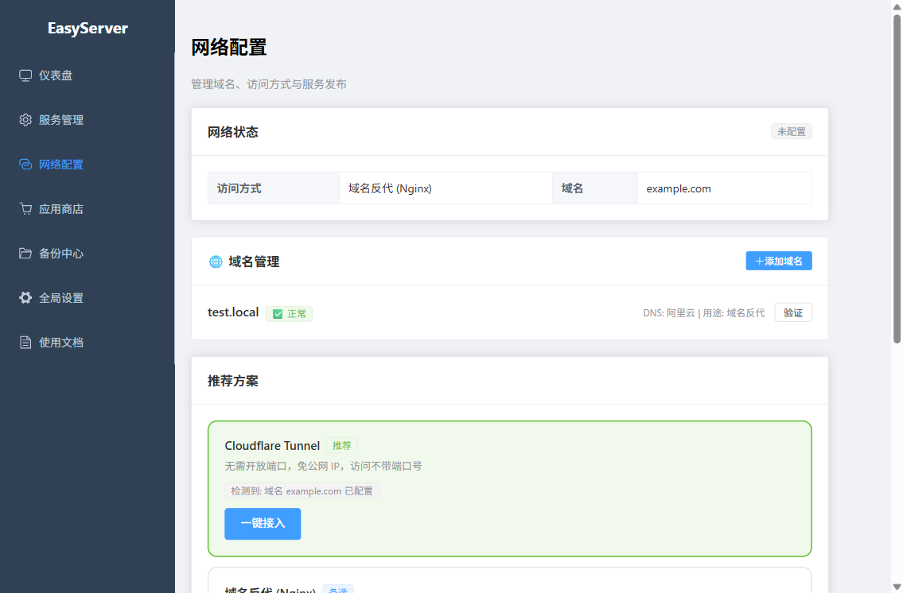
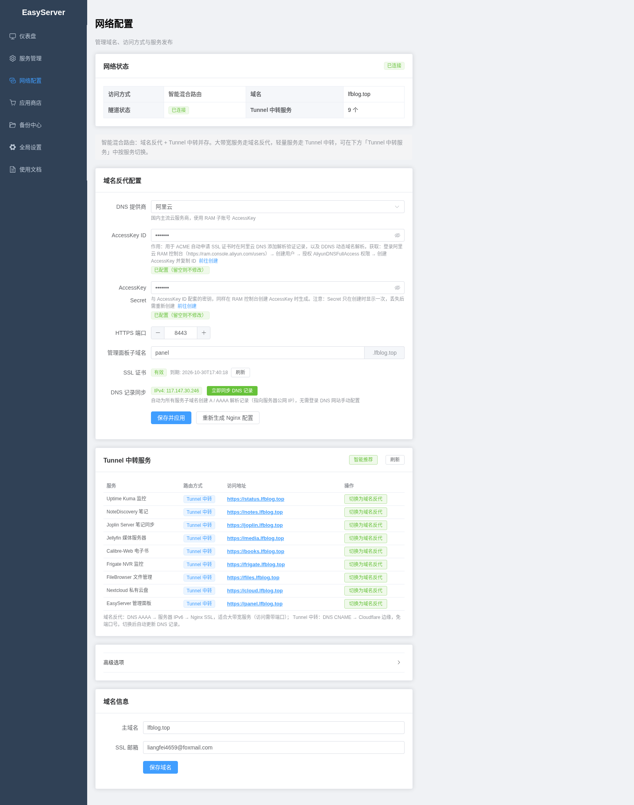
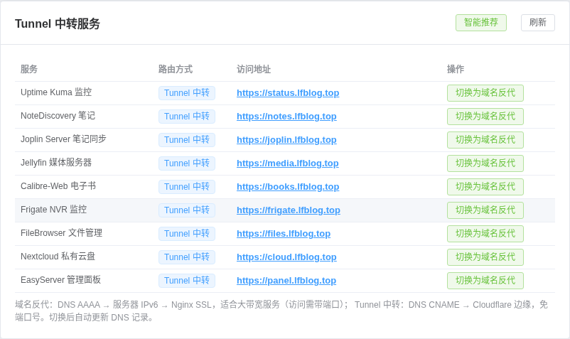

# 让你的服务被访问到：从 localhost 到域名 HTTPS 反代的完整路线图

> 你将达成：搞清楚四种访问模式怎么选，并亲手打通"浏览器输入域名 → 自动 HTTPS → 访问面板与模块"的完整链路 ｜ 预计耗时 30–45 分钟（含一次 nginx 模块安装，安装耗时随镜像是否本地缓存差异较大，不设固定预期） ｜ 适用版本 v0.3.0+（含截至 commit 4071298 的 9 项体验修复）

本指南的每条链路断言（200/301/303/444）与排错方法都来自 WSL2 mirrored 网络下的真实实测（自签证书 + /etc/hosts 域名场景）。没有真实域名和 DNS 凭据也能完整走通本教程。

---

## 开始前：你需要什么

- 已按[安装指南](INSTALL_GUIDE.md)跑起管理面板（本指南以 `http://localhost:8901` 为例）
- 明确一个事实：**模块装好后默认监听 `127.0.0.1:<端口>`**（如面板 8901、notediscovery 18000），本机就能访问；要被"别的设备"或"域名"访问，才需要后面的步骤。例外：jellyfin、nginx 等 **host 网络模式**的模块直接使用宿主网络栈，监听所有接口（`0.0.0.0`），如需限制访问面请在路由器/防火墙层面处理

---

## 第 1 步：搞清楚四种访问模式，选一个

- **操作**：面板左侧「网络配置」→ 查看访问模式选择器。四种自动模式的实测行为：

| 模式 | 适用场景 | 实测行为 |
|---|---|---|
| domain（域名反代） | 有域名，想用 HTTPS 与子域名 | 需自备 DNS/证书凭据；未装 nginx 时仅保存配置（见第 5 步） |
| ipv6_direct | 有公网 IPv6 | 实测保存后 `BIND_ADDRESS='::'`（而非 0.0.0.0），IPv6 直连各模块端口 |
| cloudflare_tunnel | 无公网 IP，想借 Cloudflare 隧道 | 需 Tunnel 凭据；隧道服务以卡片形式接入 |
| hybrid | 多种条件并存 | 智能混合路由；DNS 同步项无凭据时显示"跳过" |
| custom | 想完全手动控制 | 只保存你的自由配置，引擎不代劳 |

- **你会看到**：模式选择器高亮当前模式；切换时有确认提示。
- **截图**：  
- **排错**：

| 现象/报错 | 原因 | 解法 |
|---|---|---|
| 切换模式后部分功能显示"跳过"/BLOCKED | 相关功能（DNS 解析、证书签发、隧道）需要云服务商凭据，凭据为空时跳过属预期行为 | 先按第 2–4 步把本地链路走通，凭据配置见第 5 步 |

> 本教程主推路线：**先本机（第 2 步）→ 再域名反代（第 4 步）**，这是零凭据也能全通的路径。

---

## 第 2 步：本机访问（你现在就已经在这个模式里）

- **操作**：什么都不用配。直接：

```bash
curl -s http://127.0.0.1:8901/api/health          # 面板
curl -s -o /dev/null -w '%{http_code}\n' http://127.0.0.1:18000   # 已装模块（端口换成你的）
```

- **你会看到**：health 返回 `{"status":"ok","service":"easyserver-core"}`；模块返回 `303`（跳登录页）或 `200`。
- **截图**：无（无界面）。
- **排错**：

| 现象/报错 | 原因 | 解法 |
|---|---|---|
| curl 000 / 连接拒绝 | 模块没装或端口记错 | 面板「服务列表」看运行中模块与端口；或 `sg docker -c "docker ps --format '{{.Names}}\t{{.Ports}}'"` |

---

## 第 3 步：让局域网其他设备访问（可选）

- **操作**：把模块端口对宿主外的设备开放，取决于模块的网络模式：
  - **bridge 模式模块**（大多数）：安装时端口配置项就是宿主映射端口（如 jellyfin 实测 `0.0.0.0:18096 -> 8096`），局域网设备访问 `http://<WSL主机IP>:18096`
  - **host 模式模块**（如 nginx 默认）：容器直接用宿主网络栈，监听端口即宿主端口
- **你会看到**：局域网设备浏览器能打开对应端口。
- **截图**：无。
- **排错**：

| 现象/报错 | 原因 | 解法 |
|---|---|---|
| 本机通、局域网不通 | 端口只绑了 127.0.0.1，或 WSL 防火墙未放行 | bridge 模块确认映射 HostIp 为 0.0.0.0（`docker port <容器名>`）；Windows 侧防火墙放行对应端口 |
| WSL2 下其他设备访问 Windows IP 无效 | WSL2 NAT/mirrored 的端口转发问题 | mirrored 模式下 Windows 与 WSL 共享端口视图，直接访问 Windows 主机 IP 即可；NAT 模式需在 Windows 配置 portproxy（超出本文范围） |

---

## 第 4 步：装 nginx 模块，用域名访问（核心步骤）

实测环境：Windows 占了 80 端口，所以 HTTP 用 **8080**、HTTPS 用 **8443**；域名用 `test.local`（/etc/hosts 本地解析，零成本复现）。

### 4a. 安装 nginx 模块

- **操作**：应用商店 → nginx → 填写：

| 配置项 | 值 | 说明 |
|---|---|---|
| `NGINX_HTTP_PORT` | `8080` | 80 被占就改这个（见排错） |
| `NGINX_HTTPS_PORT` | `8443` | HTTPS 入口 |
| `NGINX_NETWORK_MODE` | `host` | 默认值，保持 |
| `SSL_EMAIL` | 你的邮箱 | 证书通知邮箱 |

- **你会看到**：安装四阶段通过，`docker ps` 里 `easyserver-nginx` 为 Up（host 模式无端口映射列，属正常）。引擎同时自动签发**自签证书**：`/easyserver_data/modules/nginx/ssl/<你的域名>/` 下生成 `fullchain.cer` 与 `test.local.key`（实测 1354B/1704B，权限 600）。
- **截图**：无（安装页形态见安装指南第 5 步描述）。
- **排错**：

| 现象/报错 | 原因 | 解法 |
|---|---|---|
| 安装"成功"但容器反复重启（实测缺陷 AF） | 生成的配置 `listen 80`，host 模式绑 80 撞 Windows 占用；健康门控存在瞬时存活窗口，极少数情况误报 success | 按下方 4b 改 http_port 后重启容器 |
| 安装失败，stage=health，error 含 `cannot load certificate` | 证书路径缺失（健康门控报真因） | 检查 ssl 目录是否生成；删掉残留的错误 conf 后重装 |

### 4b. 生成反代配置（把模块挂到域名上）

- **操作**：面板「网络配置」→ 域名管理里确认主域名（如 `test.local`）→ 调用配置生成（面板按钮或命令）：

```bash
TOKEN=$(curl -s -X POST http://localhost:8901/api/config/auth/login \
  -H 'Content-Type: application/json' -d '{"password":"<你的管理密码>"}' | sed 's/.*"token":"\([^"]*\)".*/\1/')
curl -s -X POST http://localhost:8901/api/nginx/config/generate -H "Authorization: Bearer $TOKEN"
```

- **你会看到**：生成两份配置——`default.conf`（HTTP 兜底：未知域名直接关闭连接，实测 444 行为）与 `sites.conf`（每个已安装模块一个 server 块，含 HTTPS 证书路径与反代目标端口）。nginx 容器随生成自动加载。
- **截图**：无。
- **排错**：见第 6 步（端口来源解析是重点）。

### 4c. 配置本地域名解析并验证

- **操作**：

```bash
# 1) 备份并追加 hosts（把域名指到本机）
sudo cp /etc/hosts /tmp/hosts.bak
echo "127.0.0.1 test.local panel.test.local notes.test.local" | sudo tee -a /etc/hosts

# 2) 验证（-k 表示信任自签证书）
curl -sk -o /dev/null -w '%{http_code}\n' https://panel.test.local:8443/   # 面板
curl -sk -o /dev/null -w '%{http_code}\n' https://notes.test.local:8443/   # notediscovery
curl -s  -o /dev/null -w '%{http_code}\n' http://panel.test.local:8080/    # HTTP 会跳 HTTPS
curl -s  -o /dev/null -w '%{http_code}\n' http://whatever.test.local:8080/ # 未知域名
```

- **你会看到**（实测断言）：面板 `200`；notes `303`（跳登录页，正常）；HTTP 访问面板 `301` 跳 HTTPS；**未知域名 `000`**（连接被直接关闭，即 444 兜底生效——陌生域名打不进你的服务）。
- **截图**：无。
- **排错**：测完可恢复 hosts：`sudo cp /tmp/hosts.bak /etc/hosts`（实测 diff 为空即复原）。

### 4d. 浏览器访问

- **操作**：浏览器打开 `https://panel.test.local:8443/`。
- **你会看到**：自签证书会有"不安全"警告——点"高级 → 继续访问"即可（自签场景预期行为；换真实域名 + Let's Encrypt 证书后消失）。之后就是熟悉的 EasyServer 登录页。
- **截图**：
- **排错**：浏览器报证书错误且无法继续 → 确认访问的是 8443 端口、hosts 已生效（`ping panel.test.local` 应为 127.0.0.1）。

---

## 第 5 步：真实证书（ACME / Cloudflare Tunnel）——为什么显示 BLOCKED

- **说明**：Let's Encrypt 签发（acme.sh 模块）需要**DNS 服务商 API 凭据**（阿里云 AccessKey / Cloudflare Token 等）；Cloudflare Tunnel 需要**隧道凭据**。没有凭据时这些功能显示 BLOCKED，**不是故障，是引擎诚实地不瞎试**。
- **操作**：拿到凭据后：面板「设置」→ 填入 DNS 凭据 → 网络配置选择 domain 或 cloudflare_tunnel 模式 → 按向导填入域名与凭据 → 由引擎完成签发/隧道接入。
- **你会看到**：凭据就位后，acme.sh 会把真实证书落到 nginx 的 ssl 目录（替代自签证书），浏览器不再有安全警告。
- **截图**：
- **排错**：

| 现象/报错 | 原因 | 解法 |
|---|---|---|
| acme/cloudflare 安装后功能验证 BLOCKED | 凭据为空（实测口径） | 配置凭据后重试；无凭据时仅生命周期可测属预期 |
| 自签证书日志出现 `ssl_stapling ignored` 警告 | 自签证书无签发者（OCSP staple 不适用） | **预期噪音，可忽略**（实测确认非致命） |

---

## 第 6 步：反代排错实战（六条实测经验，全踩过的坑）

### 6.1 反代端口是怎么决定的（理解它，一半的排错消失）

引擎生成 sites.conf 时，每个模块的后端端口按**运行时优先**解析（F5 机制）：

1. 先读模块端口记录（安装时你填的端口，如 notediscovery 的 18000）；
2. 读不到 → 回退模块定义里的静态默认端口（如 8000）；
3. 面板自身的反代端口则三级回退：`PANEL_PORT` 环境变量 → 引擎配置 `panel_port` → 默认 8900。

**已知坑（缺陷 AD）**：第 1 级的端口记录存在引擎容器内的易失文件里，**引擎容器重建/升级后会丢**，此时全部回退到静态默认端口 → 你用自定义端口装的模块会 502（或在 mirrored 环境连到同端口的无关服务）。**排查法（实测）**：

```bash
# 对比三处：端口记录 vs 生成配置 vs 实际映射
sg docker -c "docker exec easyserver-core cat /app/.env | grep PORT"
sg docker -c "docker exec easyserver-nginx grep -E 'server_name|proxy_pass' /etc/nginx/conf.d/sites.conf"
sg docker -c "docker ps --format '{{.Names}}\t{{.Ports}}'"
```

对不上就重装对应模块（让安装流程重新写入端口记录）再 generate。

### 6.2 HTTP 端口 80 被占：改 http_port 的正确姿势（缺陷 AG）

`http_port` 目前**没有面板/API 修改入口**（配置接口只开放 https_port/domain 等字段）。80 被占（Windows 常见）时：

```bash
# 1) 编辑引擎配置卷内的 config.yaml，加 http_port（panel_port 同理按需加）
sudo vi /var/lib/docker/volumes/easyserver_easyserver-app-data/_data/config.yaml
#    追加两行：http_port: 8080   （面板端口非默认时再加 panel_port: 8901）

# 2) 重新生成反代配置并重启 nginx
TOKEN=$(curl -s -X POST http://localhost:8901/api/config/auth/login \
  -H 'Content-Type: application/json' -d '{"password":"<你的管理密码>"}' | sed 's/.*"token":"\([^"]*\)".*/\1/')
curl -s -X POST http://localhost:8901/api/nginx/config/generate -H "Authorization: Bearer $TOKEN"
sg docker -c "docker restart easyserver-nginx"
```

实测结果：生成配置从 `listen 80` 全部变为 `listen 8080`，nginx 稳定运行于 8080/8443。

### 6.3 反代"通"了但页面不对——mirrored 假阳性陷阱（重点！）

WSL2 mirrored 模式下，Windows 侧监听的端口会"顶替"应答。实测踩坑：反代 status/媒体域名返回 302，看似成功，实际连到的是 **Windows 侧无关服务**的 dashboard。**排查铁律**：

```bash
# 怀疑后端不对时，先绕过 nginx 直接看真实后端是谁
curl -s http://127.0.0.1:<端口> | head -5
```

返回内容与预期应用对不上（比如出现 "Redirecting to /dashboard"）→ 后端被 Windows 占用/干扰，给模块换端口重装。

### 6.4 joplin 域名访问报 "Invalid origin"（三步变通，实测全通）

joplin 3.x 强校验访问来源，默认配置未暴露域名键。变通三步（实测后 `/api/ping` 返回 200）：

```bash
# ① 给模块 compose 注入访问域名（端口换成你的 joplin 实际端口）
echo 'JOPLIN_BASE_URL=https://joplin.test.local:8443' | sudo tee -a /easyserver_data/.env
# ② 重建 joplin 容器使环境变量生效（在 core 容器内执行 compose）
sg docker -c "docker exec easyserver-core sh -c 'cd /easyserver_data/modules/joplin && docker compose --env-file /easyserver_data/.env up -d --force-recreate joplin-app'"
# ③ 让 nginx 反代保留原始 Host 头（含端口）：把 sites.conf 中 joplin 块的
#    proxy_set_header Host $host;  改为  proxy_set_header Host $http_host;
sg docker -c "docker exec easyserver-nginx nginx -s reload"
curl -sk https://joplin.test.local:8443/api/ping    # → {"status":"ok",...}
```

> 第 ② 步务必带上模块端口变量（如 `JOPLIN_APP_PORT=22301`），漏掉会导致容器回退默认端口、被占用后启动失败（实测踩过）。

### 6.5 nextcloud 域名访问报 "Trusted domain error"

nextcloud 只信任初始化时登记的域名（**TRUSTED_DOMAINS 仅首次安装时生效**，之后改配置不回读）。用 occ 追加新域名：

```bash
sg docker -c "docker exec -u www-data easyserver-nextcloud php occ config:system:set trusted_domains 3 --value=cloud.test.local"
```

实测：加域名前访问返回 400 Trusted domain error（这也反证反代链路已通）；加域名后 `/status.php` 与 `/login` 均 200。

### 6.6 未知域名 HTTPS 有漏网之鱼（缺陷 AE，知悉即可）

HTTP 侧未知域名会被 444 兜底关闭；**HTTPS 侧暂无兜底**，未知 SNI 会落入第一个 server 块（面板）返回 200。不影响正常使用，但在安全敏感场景请注意该行为。

---

## 验证清单

- [ ] 能说清四种访问模式的区别，并知道自己在用哪种
- [ ] `curl http://127.0.0.1:8901/api/health` 返回 ok（本机链路）
- [ ] nginx 模块安装成功且稳定运行（非 Restarting）
- [ ] `https://panel.test.local:8443/` 浏览器可访问（自签警告可继续）
- [ ] HTTP 未知域名连接被关闭（444 兜底生效）
- [ ] 三处端口比对（/app/.env、sites.conf、docker ps）一致
- [ ] 知道 80 被占改 http_port 的文件路径与 regenerate 命令

## 完成后你可以……

- **换真域名上 HTTPS**：配置 DNS 凭据后走 ACME 签发（第 5 步），浏览器警告消失。
- **回去完善安装与日常运维**：见[安装指南](INSTALL_GUIDE.md)第 7 步。
- **逐模块深挖**：`docs/guides/modules/` 下 13 个模块教程（joplin/nextcloud 的域名特殊项已在本篇 6.4/6.5）。
