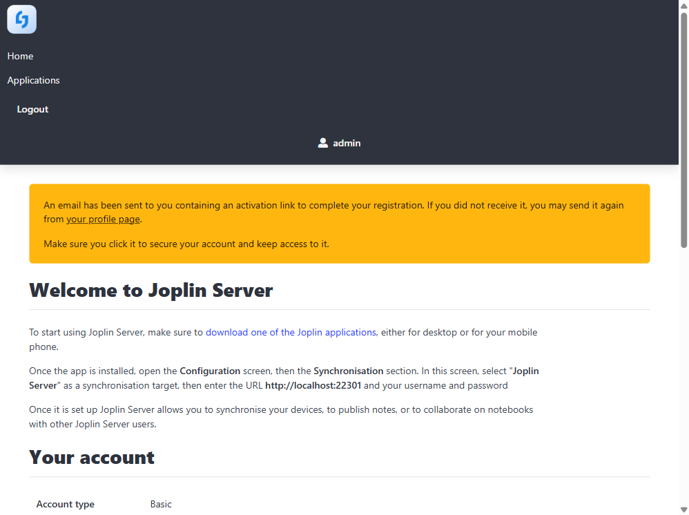

# Joplin Server 笔记同步 · 运行指南

> 基于 2026-09-04 WSL Ubuntu 24.04 实测（QA 报告 R18）。实测结论与上游描述不一致处，以实测为准并已标注。
> **重要预警：实测确认面板安装路径当前不可用（镜像 tag 不可拉取 + 引擎无本地 fallback，缺陷 S/N）**，需按 3.2 降级路径手动启动；**改端口后必须同步设置 `JOPLIN_BASE_URL`，否则服务必不可用（缺陷 T）**。

## 1. 概述

Joplin Server 是开源笔记 Joplin 的同步服务器，配合 PostgreSQL 数据库实现多设备笔记同步、端到端加密（E2EE）与笔记本共享。本模块为**双容器编排**（app + postgres），是 13 个模块中唯一的多容器模块。

> **产品能力边界（实测确认）**：Joplin Server **没有 Web 笔记编辑界面**——服务端 Web（Home / Applications 页）仅提供账号与同步管理（申请令牌、查看已授权应用等）；笔记本与笔记必须通过 **Joplin 桌面/移动客户端**配置同步后创建。期待在浏览器里写笔记会找不到入口，这不是部署出了问题。

| 项 | 值 |
|------|------|
| 镜像 | `joplin/server:3.0.1`（module.yaml 声明；**实测该 tag 不可拉取，latest 可用**）+ `postgres:16` |
| 分类 | notes |
| 网络模式 | bridge；专用内部网络 `easyserver-joplin-internal`（db/app 隔离通信） |
| 端口 | 宿主 `JOPLIN_APP_PORT`（默认 22300）→ 容器 22300 |
| 资源限制 | 内存 512m / CPU 1.0 |
| 容器名 | `easyserver-joplin-app` + `easyserver-joplin-db` |
| 内置 healthcheck | db 侧 `pg_isready -U joplin_user`（10s 间隔）；引擎靠模块健康检查 URL 探测 app |

实测亮点：compose `depends_on: condition: service_healthy` 门控**真实生效**——实测输出 `Container easyserver-joplin-db Waiting → Healthy → joplin-app Starting`，db healthy 约 11s 后 app 才启动，postgres 未就绪导致 app 启动失败的经典问题被结构性规避。

## 2. 前置条件

- 核心引擎运行中；无硬依赖模块（soft_depends_on: nginx、acme，用于域名反代访问）
- **端口检查**：22300 需可用。实测环境 22300 被 Windows 侧进程占用（WSL2 mirrored），改用 `JOPLIN_APP_PORT=22301`
- **数据库密码必须显式设置**：module.yaml 声明 JOPLIN_DB_PASSWORD "留空自动生成"（auto_generate），**实测该逻辑不存在**（引擎/compose 层均无生成逻辑，缺陷 O 族）——留空会导致 postgres 容器 `POSTGRES_PASSWORD` 空值 fatal。安装时务必显式传入，或安装后查看 `.env` 确认

## 3. 安装

### 3.1 配置字段

| 字段 | 说明 | 默认值 | 必填 |
|------|------|--------|:---:|
| `JOPLIN_APP_PORT` | 服务端口（宿主侧） | 22300 | 是 |
| `JOPLIN_DB_PASSWORD` | PostgreSQL 数据库密码 | 空 | 是（**实测必须显式设置**，见前置条件） |
| `JOPLIN_DB_USER` | 数据库用户名 | joplin_user | 是 |
| `JOPLIN_DB_NAME` | 数据库名 | joplin_db | 是 |
| `JOPLIN_BASE_URL` | 服务对外地址 | http://localhost:22300 | **面板字段表中缺失**（缺陷 T） |

> 缺陷 T：module.yaml config 未声明 `JOPLIN_BASE_URL`，但 compose 中 `APP_BASE_URL=${JOPLIN_BASE_URL:-http://localhost:22300}` 依赖它。Joplin 3.x 强校验"请求 origin == APP_BASE_URL"，**只要端口不是 22300（或经域名反代访问）就必须手动提供该值**，面板配置项不完整会导致改端口后服务必不可用。

### 3.2 安装路径与实测行为（面板安装当前不可用）

**面板/API 安装（实测失败）**：与 calibre-web 同构——module.yaml 声明的 tag `3.0.1` 被镜像链路拒绝（`denied`），且引擎 pull 无本地 fallback（缺陷 S/N 双实证，QA 中已避免重复执行以免 ~5min 无效等待）。

**实测可行的降级路径（手动 compose）**：

```bash
cd <项目根目录>/modules/joplin   # 或运行时目录 /easyserver_data/modules/joplin

# 1. 拉取可用镜像（latest 约 4.53GB，实测约 8 分钟）
docker pull joplin/server:latest
docker pull postgres:16

# 2. 编辑 docker-compose.yml：joplin-app 的 image 行改为 joplin/server:latest
#    （或 docker tag joplin/server:latest joplin/server:3.0.1——注意 uninstall 会删该 tag）

# 3. 启动（务必同时注入端口与 BASE_URL，两者保持一致）
sg docker -c "JOPLIN_APP_PORT=22301 JOPLIN_BASE_URL=http://127.0.0.1:22301 \
  JOPLIN_DB_PASSWORD=<你的数据库密码> docker compose -f docker-compose.yml up -d"
```

实测该路径成功：db 先行 healthy，app 随后启动（见第 4 节验证输出）。

## 4. 启动与验证

```bash
# 容器状态（双容器）
sudo docker ps --filter name=easyserver-joplin
# 实测输出：easyserver-joplin-db Up (healthy)；easyserver-joplin-app Up

# 引擎侧健康检查 URL（module.yaml）
curl -s http://127.0.0.1:22301/api/ping
# 实测输出：{"status":"ok","message":"Joplin Server is running"}

# 登录页可达
curl -s -o /dev/null -w '%{http_code}' http://127.0.0.1:22301/login
# 实测输出：200
```

**初始账号（上游默认，实测报告引用）**：邮箱 `admin@localhost`、密码 `admin`。首次登录后立即修改密码，并创建专用用户账户供客户端同步使用（不要把管理员账户填进客户端）。

**⚠️ 换端口必踩坑（缺陷 T）**：若 `JOPLIN_APP_PORT` 不是 22300 且未同步设置 `JOPLIN_BASE_URL`，所有 API 请求返回 `Invalid origin: http://127.0.0.1:<端口>`（HTTP 400），Web 登录同样失败。修复：设置 `JOPLIN_BASE_URL=http://127.0.0.1:<端口>` 后**重建 app 容器**（db 数据不受影响）：

```bash
sg docker -c "docker compose -f modules/joplin/docker-compose.yml up -d --force-recreate joplin-app"
```

### 4.1 Web 界面：注册账号与同步管理（无笔记编辑器）

浏览器打开 `http://127.0.0.1:22301`：首次使用点注册创建账号（注册开关 `SIGNUP_ENABLED` 服务端默认开启）；注册后用邮箱+密码登录，看到的就是全部 Web 能力——首页（下图，管理员已登录）与 Applications 页（管理同步令牌/已授权客户端）。**在这里找不到写笔记的入口属正常**：服务端只管账号与同步，笔记在客户端里（见 4.2）。



> 注册后服务端会提示“激活邮件已发送”：本机默认无邮件投递（无 MTA），**Web 使用不受影响**；若客户端同步报账号待激活，先回服务端 Web 登录一次确认账号可用（或由管理员在用户管理里确认），再回客户端重试。

### 4.2 客户端同步配置（笔记在这里建）

在 Joplin 桌面/移动客户端（官网下载）中：工具 → 选项 → 同步，三项填写——

1. **同步目标**：选 Joplin Server（WebDAV 之外的 Joplin Server 项）
2. **服务器地址**：`http://<服务器IP>:22301`（经域名反代则填 `https://joplin.<你的域名>:8443`，且服务端需保证 origin 校验通过，见 FAQ）
3. **账号邮箱/密码**：用 4.1 创建的账号（不要把管理员账户填进客户端，至少建一个专用同步账号）；自签/HTTP 场景若客户端报证书错误，勾选**忽略 SSL 验证**选项

点“检查同步配置”→ 成功提示后，客户端里新建笔记本与笔记，同步后多端可见——这也是唯一建笔记的途径。

## 5. 访问方式

- **直连**：`http://<服务器IP>:<JOPLIN_APP_PORT>`（默认 22300）
- **nginx 反代子域名**：域名反代/混合路由模式下 `https://joplin.你的域名:8443`（`access.subdomain: joplin`）——此时客户端"服务器地址"应填反代地址，且需在服务端保证 origin 校验通过（见 FAQ）
- **Cloudflare Tunnel**：Tunnel 模式下发布后经 `https://joplin.你的域名` 免端口访问

## 6. 数据与备份

| 路径 | 内容 |
|------|------|
| `<DATA_DIR>/joplin/postgres/` | PostgreSQL 数据目录（全部笔记数据） |

备份方法：备份该目录即可。更稳妥的做法是用 Joplin 客户端导出 JEX 格式（官方推荐的迁移格式）；数据库活动写入期间建议停容器后备份。若部署了 backup 模块，该目录自动纳入 `data/` 全量备份范围。

## 7. 卸载

- 面板卸载或 `POST /api/modules/uninstall`（`remove_data: true`）；实测返回 `removed_paths:["/app/data/joplin"]`（容器内前缀，缺陷 F 族），宿主 `<DATA_DIR>/joplin` **残留**（需 sudo 清理）
- **实测确认清理完整性**：双容器均删；自定义网络 `easyserver-joplin-internal` 已删
- **实测警告（缺陷 D 第 7/8 例）**：卸载会**自动删除 `postgres:16` 与 `joplin/server:3.0.1` 两个镜像**（`latest` tag 幸存）——postgres:16 为通用基础镜像，删除影响其他潜在使用方，注意重拉成本

## 8. FAQ

**Q：面板安装一直失败（failed/pull）？**
实测已知问题：tag `3.0.1` 当前不可拉取（latest 可用），且引擎 pull 无本地 fallback。按 3.2 降级路径手动启动。

**Q：所有请求报 `Invalid origin`（缺陷 T）？**
Joplin 3.x 强校验请求 origin 与 `APP_BASE_URL` 一致。换端口或经域名反代访问时，必须设置 `JOPLIN_BASE_URL` 为实际访问地址并重建 app 容器（面板字段表当前缺失该项，需手动注入环境变量）。

**Q：Web 界面怎么找不到写笔记的地方？**
产品本身没有 Web 笔记编辑界面：服务端只提供账号/同步管理（见 4.1）。装 Joplin 桌面/移动客户端按 4.2 配置同步后，在客户端里建笔记本与笔记。

**Q：客户端同步失败？**
按序检查：① 服务器地址是否与 `JOPLIN_BASE_URL` 一致（origin 校验）；② 账户密码是否正确（用 Web 界面创建的同步账户，非管理员账户）；③ 账号是否待激活（注册后服务端提示激活邮件已发送，本机无邮件投递时 Web 不受影响，但客户端同步可能被拦，先回服务端确认账号可用）；④ 自签/HTTP 场景勾选客户端“忽略 SSL 验证”；⑤ `docker logs easyserver-joplin-app` 查看错误。

**Q：注册页不可用/注册接口返回 403？**
检查服务端注册开关：joplin server 默认 `SIGNUP_ENABLED=true`（实测容器 env 已含）；若被显式关为 `false`，在 compose 的 joplin-app environment 段追加 `SIGNUP_ENABLED=true` 后重建容器。

**Q：忘记管理员密码？**
官方方法（module.yaml 引用）：`docker exec -it easyserver-joplin-app npm --prefix packages/server/tools reset-admin-password`。

**Q：数据库密码留空安装会怎样？**
实测确认"留空自动生成"无实现（缺陷 O 族）：postgres 容器因 `POSTGRES_PASSWORD` 为空 fatal，app 因依赖门控不会启动。必须显式传入密码；已写入 `.env` 的可查看确认。

## 9. 实测排错

实测环境：WSL2 mirrored（22300 被占，改 22301）。关键证据摘录（QA 报告 R18）：

```
# 依赖门控（compose up 输出，pg_isready 真实生效）
Container easyserver-joplin-db Waiting
Container easyserver-joplin-db Healthy          ← pg_isready 通过（约 11s）
Container easyserver-joplin-app Starting
# 换端口 origin 校验（未设 BASE_URL 时）
$ curl http://127.0.0.1:22301/api/ping → Invalid origin: http://127.0.0.1:22301
# BASE_URL 对齐后
$ curl http://127.0.0.1:22301/api/ping → {"status":"ok","message":"Joplin Server is running"}
$ curl -o /dev/null -w '%{http_code}' http://127.0.0.1:22301/login → 200
# uninstall 清理
{"success":true,...,"removed_paths":["/app/data/joplin"]}
$ docker network ls → easyserver-joplin-internal 已删
$ docker images → postgres:16 / joplin/server:3.0.1 已消失（latest 幸存）；/data/joplin 残留
```
